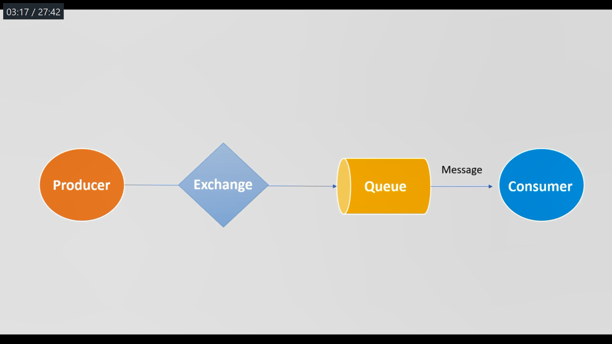
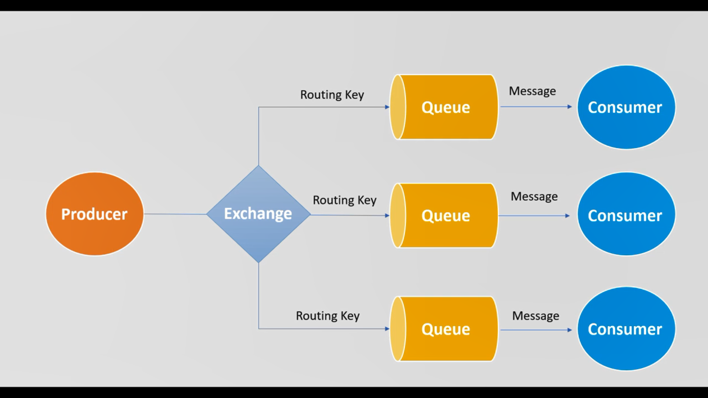

**RabbitMQ**

1. RabbitMQ is a message broker that originally implements the _Advance Message Queuing Protocol_(AMQP)
2. AMQP standardizes messaging using Producers, Broker and Consumers

Producer ---> Exchange ---> Queue ---> Consumer

Producer publish the message to exchange.
Exchange will redirect the message to a corresponding queue.

Running RabbitMQ
1. Go to C:\Program Files\RabbitMQ Server\rabbitmq_server-3.8.19\sbin
2. Run command rabbitmq-plugins enable rabbitmq_management
3. Run rabbitmq-service.bat start
4. Open http://127.0.0.1:15672/
5. initial username - guest password - guest